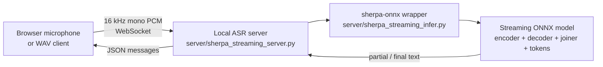

<div align="center">

# Deployment for icefall Streaming ASR Models

Local CPU deployment toolkit for icefall streaming Zipformer transducer ONNX models.

[](#requirements)
[](#quick-start)
[](#model-files)
[](#how-it-works)
[](#quick-start)

</div>

This repository turns an exported icefall streaming ASR model into a small local demo:

```text
ASR WebSocket  ->  ws://127.0.0.1:8766
Browser demo   ->  http://127.0.0.1:7860
```

It contains deployment code only. Large ONNX model files are intentionally not committed. Add your own exported model with `scripts/add_model.*`.

## Highlights

| Capability | What is included |
|---|---|
| Local CPU inference | Runs streaming Zipformer transducer ONNX models with `sherpa-onnx` |
| Browser demo | Demo-mode UI with microphone input, file upload, WebSocket streaming, and live transcript display |
| File test client | Send a WAV file to the WebSocket server before opening the browser |
| Model registry | Add, list, switch, and remove models through `models.json` |
| Cross-platform scripts | Bash scripts for macOS/Linux/WSL2 and PowerShell scripts for native Windows |
| Lightweight repo | No large model weights in Git; models are imported locally after clone |

## Quick Start

### macOS / Linux / Windows WSL2

```bash
git clone https://github.com/Gilgamesh-J/deployment-for-icefall-streaming-model.git
cd deployment-for-icefall-streaming-model

bash scripts/install_cpu_env.sh

bash scripts/add_model.sh \
  --source-dir /path/to/your_model_dir \
  --model-id my_model \
  --label "My ASR Model"

MODEL_ID=my_model bash scripts/run_server_cpu.sh
```

Open a second terminal:

```bash
cd deployment-for-icefall-streaming-model
bash scripts/run_web_demo.sh
```

Open:

```text
http://127.0.0.1:7860
```

Keep the page WebSocket URL as:

```text
ws://127.0.0.1:8766
```

Choose `Microphone` for live speech, or choose `Audio file` to upload a local audio file and stream it through the same WebSocket path.

### Windows PowerShell

```powershell
git clone https://github.com/Gilgamesh-J/deployment-for-icefall-streaming-model.git
cd deployment-for-icefall-streaming-model
Set-ExecutionPolicy -Scope Process -ExecutionPolicy Bypass

.\scripts\install_cpu_env.ps1

.\scripts\add_model.ps1 `
  --source-dir C:\path\to\your_model_dir `
  --model-id my_model `
  --label "My ASR Model"

.\scripts\run_server_cpu.ps1 -ModelId my_model
```

Open a second PowerShell window:

```powershell
cd deployment-for-icefall-streaming-model
Set-ExecutionPolicy -Scope Process -ExecutionPolicy Bypass
.\scripts\run_web_demo.ps1
```

Open:

```text
http://127.0.0.1:7860
```

Choose `Microphone` for live speech, or choose `Audio file` to upload a local audio file and stream it through the same WebSocket path.

## Model Files

Each deployable model folder should contain:

```text
your_model_dir/
├── encoder*.onnx
├── decoder*.onnx
├── joiner*.onnx
└── tokens*.txt
```

Example:

```text
my_streaming_model/
├── encoder-iter-96000-avg-3-chunk-48-left-256.onnx
├── decoder-iter-96000-avg-3-chunk-48-left-256.onnx
├── joiner-iter-96000-avg-3-chunk-48-left-256.onnx
└── tokens.txt
```

Rules:

- `encoder`, `decoder`, `joiner`, and `tokens.txt` must come from the same exported model.
- Do not mix `tokens.txt` from another model.
- If an ONNX file is only a few hundred bytes or a few KB, it is probably a Git LFS pointer or incomplete download.

## How It Works



Runtime layout after adding a model:

```text
models/my_model/
├── encoder.onnx
├── decoder.onnx
├── joiner.onnx
└── tokens.txt
```

`models.json` records model metadata and lets the launch scripts resolve paths automatically.

## Repository Structure

```text
deployment-for-icefall-streaming-model/
├── server/
│   ├── sherpa_streaming_infer.py
│   ├── sherpa_streaming_server.py
│   └── sherpa_streaming_client.py
├── scripts/
│   ├── install_cpu_env.sh / install_cpu_env.ps1
│   ├── add_model.sh      / add_model.ps1
│   ├── list_models.sh    / list_models.ps1
│   ├── remove_model.sh   / remove_model.ps1
│   ├── run_server_cpu.sh / run_server_cpu.ps1
│   ├── run_wav_client.sh / run_wav_client.ps1
│   └── run_web_demo.sh   / run_web_demo.ps1
├── web/
│   └── index.html
├── examples/
│   ├── sample_zh.wav
│   └── sample_en.wav
├── models.json
├── requirements.txt
├── MODEL_EXPANSION.md
├── NOTION_LOCAL_CPU_TUTORIAL.md
└── README.md
```

## Requirements

| Item | Requirement |
|---|---|
| Python | 3.9 or newer |
| Runtime | CPU |
| Browser | Chrome / Edge / Safari |
| macOS / Linux / WSL2 | Use `scripts/*.sh` |
| Native Windows | Use `scripts/*.ps1` in PowerShell |

Python dependencies are listed in `requirements.txt`:

```text
numpy
websockets
soundfile
librosa
sherpa-onnx
```

## Common Commands

### Add and List Models

```bash
bash scripts/add_model.sh \
  --source-dir /path/to/your_model_dir \
  --model-id my_model \
  --label "My ASR Model"

bash scripts/list_models.sh
```

Windows PowerShell:

```powershell
.\scripts\add_model.ps1 `
  --source-dir C:\path\to\your_model_dir `
  --model-id my_model `
  --label "My ASR Model"

.\scripts\list_models.ps1
```

### Start ASR Server

```bash
MODEL_ID=my_model bash scripts/run_server_cpu.sh
MODEL_ID=my_model PORT=8777 bash scripts/run_server_cpu.sh
MODEL_ID=my_model NUM_THREADS=4 bash scripts/run_server_cpu.sh
MODEL_ID=my_model DRY_RUN=1 bash scripts/run_server_cpu.sh
```

Windows PowerShell:

```powershell
.\scripts\run_server_cpu.ps1 -ModelId my_model
.\scripts\run_server_cpu.ps1 -ModelId my_model -Port 8777
.\scripts\run_server_cpu.ps1 -ModelId my_model -NumThreads 4
.\scripts\run_server_cpu.ps1 -ModelId my_model -DryRun
```

### Test with WAV

```bash
bash scripts/run_wav_client.sh examples/sample_zh.wav
SERVER_URI=ws://127.0.0.1:8777 bash scripts/run_wav_client.sh examples/sample_zh.wav
```

Windows PowerShell:

```powershell
.\scripts\run_wav_client.ps1 examples\sample_zh.wav

$env:SERVER_URI = "ws://127.0.0.1:8777"
.\scripts\run_wav_client.ps1 examples\sample_zh.wav
```

### Start Browser Demo

```bash
bash scripts/run_web_demo.sh
WEB_PORT=7861 bash scripts/run_web_demo.sh
```

Windows PowerShell:

```powershell
.\scripts\run_web_demo.ps1
.\scripts\run_web_demo.ps1 -WebPort 7861
```

Do not open `web/index.html` directly with `file://`; browser microphone permissions may be blocked. Use `http://127.0.0.1:7860`.

The transcript panel is scrollable. If you scroll up to review earlier text, new partial results will not force the panel back to the latest line. Use `Jump to latest` to resume auto-follow.

## Documentation

| File | Purpose |
|---|---|
| [`NOTION_LOCAL_CPU_TUTORIAL.md`](NOTION_LOCAL_CPU_TUTORIAL.md) | Concise tutorial suitable for copying into Notion |
| [`MODEL_EXPANSION.md`](MODEL_EXPANSION.md) | Add, list, switch, and remove models |
| [`MANIFEST.md`](MANIFEST.md) | File-by-file package manifest |

## Model Distribution

Large ONNX files are intentionally not committed to this repository. Recommended workflows:

```text
Option A: Host deployment code on GitHub and host models on Hugging Face or another release page.
Option B: Use Git LFS if you really want ONNX files in the same repository.
Option C: Keep each model release separate and import it with scripts/add_model.*.
```

For most users, Option A or C is simpler.
